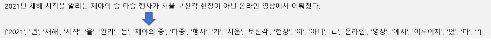
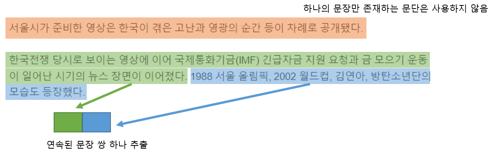
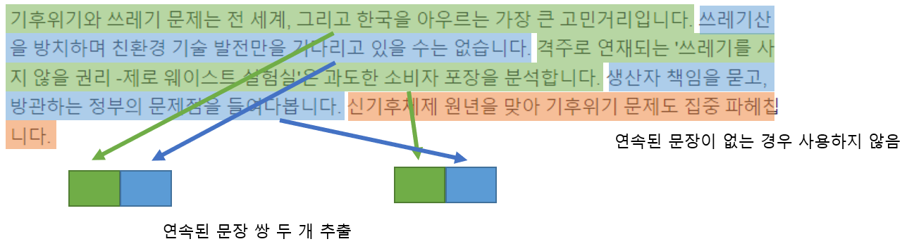
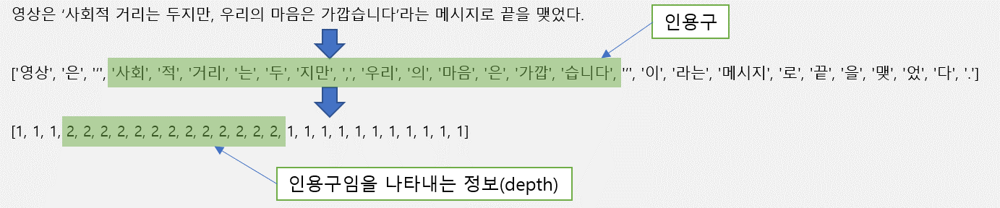
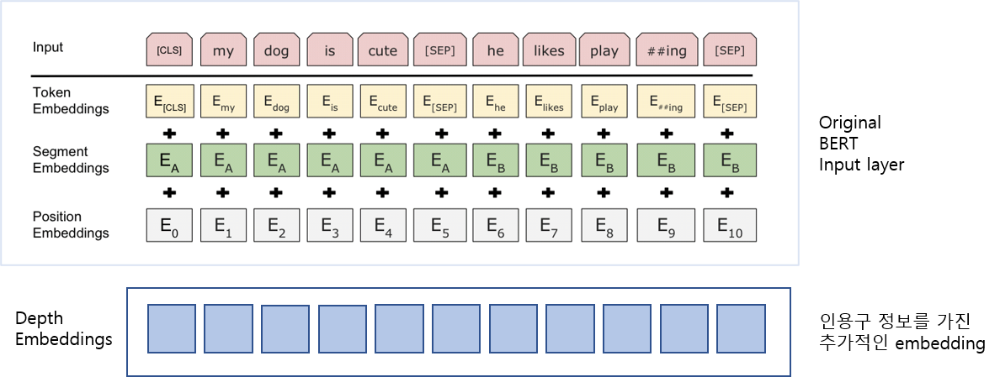
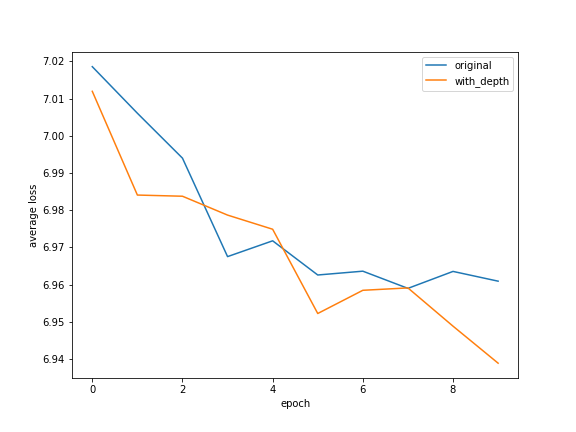
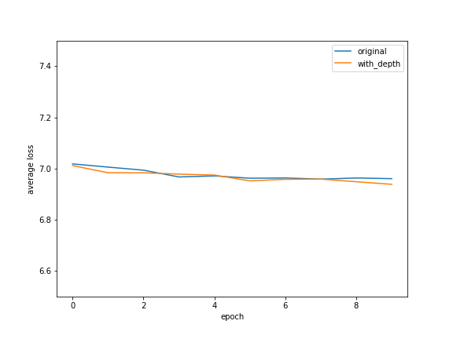
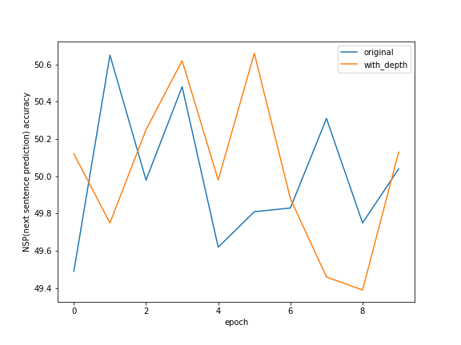

# 문장 내 인용구 정보 추가에 따른 BERT 성능 변화 유무 테스트

## 동기

BERT는 현재 자연어처리 분야에서 좋은 성능을 보이고 있는 언어 모델입니다. BERT는 문장단위로 입력을 받는데, 문장을 구성하고 있는 token 과 그 순서 등 문장의 정보가 전달됩니다. BERT에 대해서 공부하다가 input으로 더 많은 정보를 전달하면 BERT의 성능을 향상시킬 수도 있을 것이라는 생각을 하게 되었습니다. 특히 문장 구조에 대한 정보라면 도움이 될 것 같았습니다.

문장의 구조적 정보는 기본적으로는 문법에 의한 구조를 생각할 수 있습니다. 하지만, 좀 단순하게 생각하면 인용구가 있는 문장에서 인용구에 대한 정보 역시 구조적 정보라고 할 수 있습니다. 인용부호 내부에 있는 문장은 주 문장에서 구(句) 역할을 한다는 약속이 있기 때문입니다. 그리고 인용문이 특히 많이 사용되는 뉴스에서는 이 특징이 더 강조될 것이라 생각했습니다.

그래서 뉴스를 대상으로 학습하는 BERT에 인용구 정보를 함께 전달한다면 성능에 영향을 줄 수 있지 않을까 하여 테스트를 설계하고 시행해 보았습니다.

## Tokenizer

한국어를 대상으로 할 것이기 때문에 한국어에 적합한 tokenizer 가 필요합니다. 한국어는 언어유형학상 교착어로, 영어와 달리 한 낱말이 어근과 접사로 구성되기 때문에 단순히 공백을 단위로 token을 구분하면 적절한 의미를 전달하기 힘듭니다. 한국어를 대상으로 하는 tokenizer는 여러 개 이미 존재하는데, 여기서는 속도와 성능에서 균형이 잡혀있다고 평가받는 Komoran을 사용하도록 하였습니다. Komoran을 통해 문장을 형태소(token) 단위로 분해하고, 이를 바탕으로 BERT의 vocabulary(BERT에서 token 과 그에 해당하는 번호 정보를 가지는 map)를 만들게 됩니다.

아래는 문장을 Komoran으로 분해한 예시입니다.

- Komoran: https://github.com/shineware/KOMORAN

## 데이터수집 및 가공

BERT 학습에는 두 개의 연속된 문장이 필요합니다. 여기서는 약 78만 개의 뉴스를 수집하고 이를 대상으로 문장을 추출합니다. 수집한 뉴스 중 Tokenizer 가 정상적으로 분석할 수 없는 문장이나 인용부호쌍이 적절하게 사용되지 않은 문장은 제외하고 문단 내에서 연속된 두 개의 문장들을 한 쌍으로 추출합니다. 아래는 예시입니다.

결과로 약 428 만 쌍을 추출할 수 있었습니다. 다만, 이대로는 vocabulary 크기가 너무 크기 때문에 이 중 임의로 100 만 쌍을 선택하여 학습 용 데이터로 삼고, 임의의 1만 쌍을 테스트 용 데이터로 사용합니다.

그런데, 아직도 다루기에는 vocabulary 크기가 너무 커서 2개 이하로 나오는 token을 제외하였습니다. 제외된 token이 포함된 문장도 학습용 데이터에서 제외하여 최종적으로 다음과 같은 데이터양을 사용하게 되었습니다.

| 데이터 종류 | 데이터양 |
|:---:|:---:|
| 학습용 데이터 | 문장 910926 쌍 |
| 테스트용 데이터 | 문장 10000 쌍 |
| Vocabulary size | 96145 |

## 인용구 정보 임베딩

인용구를 표현하기 위해 문장에 깊이(depth) 개념을 추가합니다. 인용된 부분, 즉 인용 부호로 감싸진 부분의 문장은 주변보다 depth 가 하나 더 깊다고 판단합니다. 선별한 각 문장들에 대해서 depth 값을 구합니다.

이 정보를 BERT 로 전달하기 위해 기존 모델을 수정합니다.

 
기존 BERT의 경우 문장 정보를 전달하기 위한 input representation 영역이 있으며 여기서 각 token 별로 embedding 된 값을 더하는 방식으로 정보를 전달합니다. 이 영역에 추가로 문장의 depth 처리를 위한 요소(Depth Embeddings)를 추가하여 인코더에 depth 정보를 전달하도록 합니다.

## BERT 코드

학습에 사용한 BERT 모델은 기존에 공개된 것들 중 하나를 사용하였습니다. pytorch 로 구현된 버전이 있어서 이를 사용하였습니다. (https://github.com/codertimo/BERT-pytorch)

이번 실습에서는 수정이 필요한 부분이 있기 때문에 수정하여 사용하였습니다

- Komoran의 경우 token에 공백이 포함될 수 있기 때문에 공백(' ')으로 token을 구분하던 부분을 공백이 아닌 임의의 delimiter를 사용하도록 수정하고 BERT의 input으로 전달 시에도 해당 delimiter를 사용하도록 한다.
- 위에서 언급했듯이 BERT의 input representation 영역에 문장의 depth 정보 처리를 위한 Depth Embedding을 추가하고, 기존 값에 더하여서 인코더로 전달할 수 있도록 한다. 이렇게 input representation 영역을 수정한 버전을 with_depth 버전이라고 명칭.
- 수정된 코드: https://github.com/bitgadak/bert-practice/tree/master/bert_practice

## 학습 및 결과

비교를 위해 기존 BERT(original)를 이용해서 먼저 학습을 수행합니다. 그 후 수정한 버전(with_depth)을 이용해서 동일한 데이터로 학습을 수행하였습니다. 기타 파라미터는 아래와 같습니다. 시간과 컴퓨팅 파워의 제약이 있어 소규모로 BERT를 구동하였습니다.

| 파라미터 종류 | 값 |
|:---:|:---:|
| Hidden size | 256 |
| Number of layers | 4 |
| Number of attention heads | 4 |
| Maximum length of sequence | 512 |
| Batch size | 16 |
| Number of epochs | 10 |
| Learning rate(ADAM) | 0.001 |
| Dropout rate | 0.1 |

각 epoch가 완료되었을 때마다, 동일한 1만개의 테스트 데이터로 성능을 측정하였습니다. 손실함수의 오차, 문장 예측도 이렇게 두 가지를 가지고 비교를 하려고 합니다.

먼저, 두 모델의 손실함수의 오차를 비교합니다.

BERT는 2가지 방법으로 학습을 하는데, 하나는 문장 내 가려진 단어를 추정하는 MLM(Masked Language Model) 과 두 문장이 연속되어 있는지 추정하는 NSP(Next Sentence Prediction) 입니다. 

학습된 BERT 모델은 MLM과 NSP의 결과를 예측하고 이때의 오차를 손실함수 Negative Log Likelihood Loss 로 계산합니다.

다음 그래프는 두 모델의 Loss 평균을 epoch 별로 나타낸 것입니다. (작을수록 고성능)

10 번의 epoch 에서 임베딩 층을 수정한 버전(with_depth) 의 loss 가 미세하게 작아보입니다. 성능이 개선되었다고 판단할 수도 있지만, 실제로는 차이가 미미해서 속단하기는 힘듭니다. 아래는 스케일을 수정한 그래프인데, 그 값이 미세함을 알 수 있습니다.

다음으로 어떤 문장 다음에 온 문장이 연속된 문장인지 얼마나 잘 예측하는지 (NSP)에 대해서도 비교합니다. 아래 그래프는 예측을 얼마나 잘 했는지 % 단위로 표시한 것입니다. (값이 클수록 고성능)

두 모델 모두 정확한 예측을 하지 못하고 있습니다. NSP에 대해서는 두 모델이 유의미한 차이가 없는 것으로 보입니다.

## 결론과 한계

지금까지 소규모로 시행한 BERT의 pre-training 에서는 수정한 모델이 유의미하게 더 나은 결과를 보인다고 판단하기는 어려운 것 같습니다. 다만 (다른 원인에 의한 것일 수도 있으나) 수정한 모델(with-depth)의 loss 가 미세하게나마 작은 결과를 보여주었기 때문에, 시간과 컴퓨팅파워를 더 사용하면 좀 더 선명한 결과를 볼 가능성이 있다고 생각합니다.

인용구에 대한 정보를 BERT가 스스로 학습하는 것이 아니라 input으로 전달하고 있다는 점이 적절한지에 대해서도 재고가 필요할 것 같습니다. 스스로 학습할 수 있다면 더 좋은 모델이라고 할 수 있을 것 같습니다.

## 앞으로의 계획

- 인용구뿐 아니라 문장 구조에 대한 임베딩도 테스트 (예를 들어 문장의 parse tree 임베딩)
- 전달하는 것이 아니라 학습이 가능하다면 그쪽으로 시도 (Embedding 레이어 보다는 attention head 쪽을 수정)

## 기타
- 참고한 원본: https://github.com/codertimo/BERT-pytorch
- 이 프로젝트에 사용된 수정된 BERT: https://github.com/bitgadak/bert-practice/tree/master/bert_practice
- 수정된 부분에 대한 github compare:
  + https://github.com/bitgadak/bert-practice/compare/2b31ad6285becc1a9d8b70e09ed928f1c9773be0...1a8d1effe329ba94aa8901be0e35b4d1badba52d
